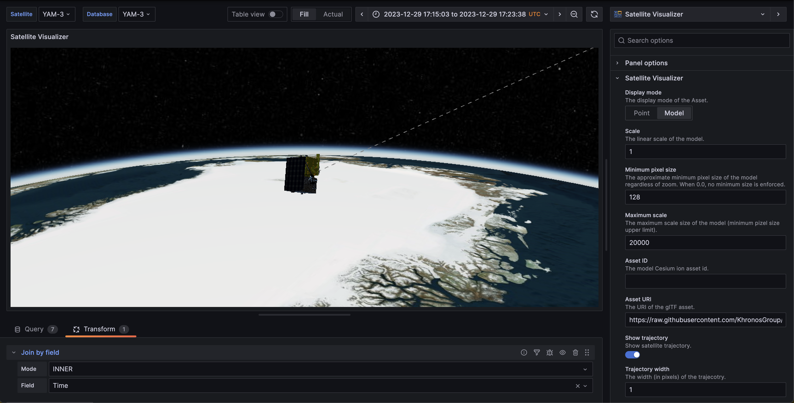
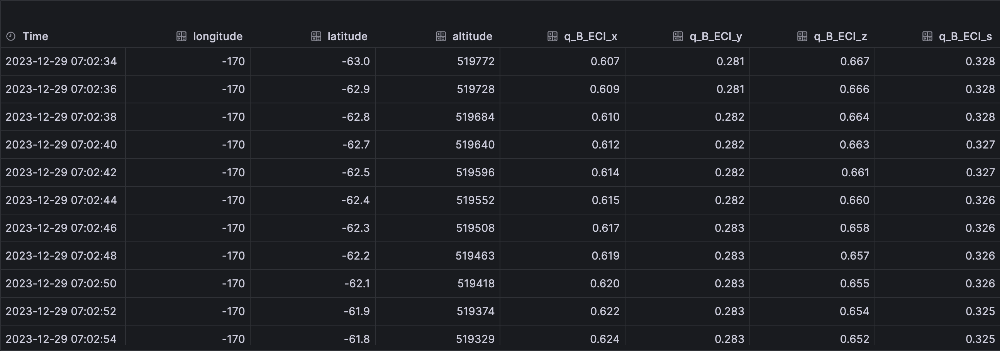

# Satellite Visualizer

A satellite visualization panel plugin for Grafana based on [CesiumJS](https://cesium.com/platform/cesiumjs/).



## Settings

1. Set `Access token` with a [Cesium ion access token](https://cesium.com/learn/ion/cesium-ion-access-tokens/) ([security best practices](https://cesium.com/learn/ion/cesium-ion-access-tokens/#security-best-practices-for-tokens)).
2. (optional) Set `Asset ID` with ID of the [glTF](https://www.khronos.org/gltf/) asset stored in Cesium ion.

## Data

This plugin needs a data series with 8 columns:

| Column # | Description                                             |
| -------- | ------------------------------------------------------- |
| 1        | Time                                                    |
| 2        | Longitude (`deg`) / x_ECI (`m`) / x_ECEF (`m`)          |
| 3        | Latitude (`deg`) / y_ECI (`m`) / y_ECEF (`m`)           |
| 4        | Altitude (`m`) / z_ECI (`m`) / z_ECEF (`m`)             |
| 5-8      | Orientation in inertial frame (`x, y, z, s` quaternion) |



## Development

To start the development environment container:

```shell
make dev
```

Access the started Grafana instance at <http://localhost:3000>.

## Release

To create a new release, run the following to bump the version in `package.json`:

```shell
npm version minor
```

Then push the tagged commit, to let the CI handle it:

```shell
git push origin main --follow-tags
```

## References

- [CesiumJS](https://cesium.com/platform/cesiumjs/)
- [Resium](https://resium.reearth.io/)
